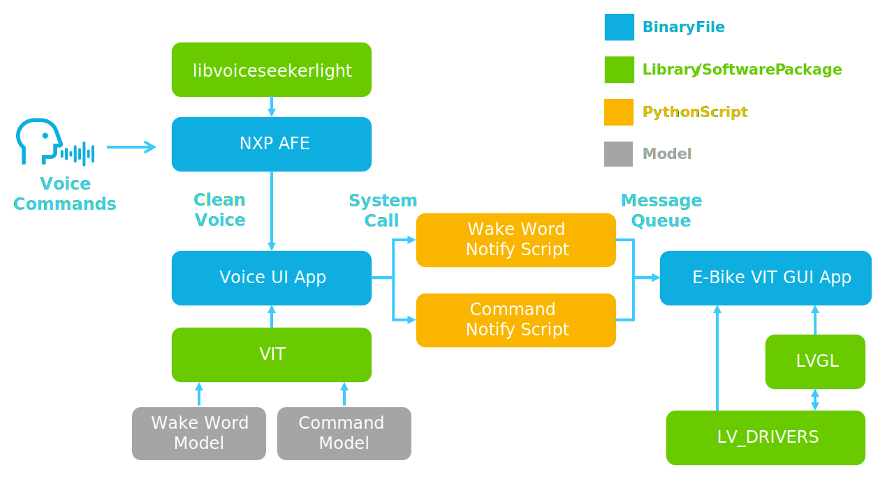

# i.MX E-Bike VIT

<!----- Boards ----->
[](https://www.nxp.com/products/processors-and-microcontrollers/arm-processors/i-mx-applications-processors/i-mx-8-applications-processors/i-mx-8m-plus-arm-cortex-a53-machine-learning-vision-multimedia-and-industrial-iot:IMX8MPLUS)
[](https://www.nxp.com/products/processors-and-microcontrollers/arm-processors/i-mx-applications-processors/i-mx-8-applications-processors/i-mx-8m-mini-arm-cortex-a53-cortex-m4-audio-voice-video:i.MX8MMINI) [](https://www.nxp.com/products/processors-and-microcontrollers/arm-processors/i-mx-applications-processors/i-mx-9-processors/i-mx-93-applications-processor-family-arm-cortex-a55-ml-acceleration-power-efficient-mpu:i.MX93)
 

[*i.MX E-Bike VIT*](https://github.com/nxp-imx-support/ebike-vit) showcases the *Multimedia* capabilities of i.MX to emulate an interactive ebike through a GUI controlled by voice commands. The GUI is
based on LVGL ([Little Versatile Graphic Library](https://lvgl.io/)) and NXP's [Voice Intelligent Technology](https://www.nxp.com/design/design-center/software/embedded-software/voice-intelligent-technology-wake-word-and-voice-command-engines:VOICE-INTELLIGENT-TECHNOLOGY) (VIT) supports the voice commands.

## Implementation using VIT and LVGL

>**NOTE:** This block diagram is simplified and do not represent the complete E-Bike VIT implementation. Some elements
were omitted and only the key elements are shown.

User gives voice commands to the EVK through Wake Words and pre-defined commands. The NXP AFE module filters the voice sound and sends it to the Voice UI application module which makes the system call to the Python script. This Python application detects the Wake Word and commands provided and allocates them in the Message Queue to be attended by the E-Bike VIT GUI application, finally showing the corresponding animation.



The UI pages are as below.


### NXP AFE

* The audio front-end (AFE) is used as a feed for VIT voice recognition.
* It helps to clean noise and echo by using
the source and a reference of the speaker.
* With NXP AFE is possible to have a clear single channel microphone audio that
can be used for processing.

### Voice UI App

* This application uses the model to detect
wakewords and commands.
* This binary file makes possible the connection of the Wake Word Model and Command Model created on VIT with the Python scripts WakeWordNotify or WWCommandNotify to detect and diferenciate the system triggers.

### E-Bike VIT GUI App

* The graphic user interface (GUI) allows the user to see a graphic representation of the ebike that gets the Wake Words and the Commands.
* Shows the ebike page switch corresponding the Wake Words and Commands given by the user.
* To create a high-quality display it uses the LVGL graphics library.

## Usage

The VIT voice command interface works as follows: You must say a wakeword first to wakeup the ebike control, then you can say the command you want to execute. The list of supported wakewords and commands are:

### Wake words supported

* HEY NXP
* HEY E Bike

### Voice Commands supported

General commands (work with any wakeword)

* NEXT PAGE
* LAST PAGE
* RUN DEMO
* STOP DEMO

>**NOTE:** The command list is very short and simple, user can created more commands to control or enable any components in the UI.

## Table of Contents

1. [Software](#1-software)
2. [Hardware](#2-hardware)
3. [Build](#3-setup)
4. [Results](#4-results)
5. [FAQs](#5-faqs)
6. [Support](#6-support)
7. [Release Notes](#7-release-notes)

## 1 Software

*i.MX E-Bike VIT* is part of Linux BSP available at [Embedded Linux for i.MX Applications Processors](https://www.nxp.com/design/design-center/software/embedded-software/i-mx-software/embedded-linux-for-i-mx-applications-processors:IMXLINUX). All the required software and dependencies to run this application are already included in the BSP.

i.MX Board          | Main Software Components
---                 | ---
**i.MX 8M Plus EVK** | LVGL + VIT + AFE
**i.MX 8M Mini EVK** | LVGL + VIT + AFE
**i.MX 93 EVK**      | LVGL + VIT + AFE

>**NOTE:** If you are building the BSP using Yocto Project instead of downloading the pre-built BSP, make sure
the BSP is built for *imx-image-full*, otherwise GoPoint is not included. The E-Bike VIT software is only
available in *imx-image-full*.

## 2 Hardware

To test *i.MX E-Bike VIT*, either the i.MX 8M Plus, i.MX 8M Mini or i.MX 93 EVKs are required with their respective hardware components.

Component                                         | i.MX 8M Plus       | i.MX 8M Mini       | i.MX 93
---                                               | :---:              | :---:              | :---:
Power Supply                                      | :white_check_mark: | :white_check_mark: | :white_check_mark:
HDMI Display                                      | :white_check_mark: | :white_check_mark: | :white_check_mark:
USB micro-B cable (Type-A male to Micro-B male)   | :white_check_mark: | :white_check_mark: |
USB Type-C cable  (Type-A male to Type-C male)    |                    |                    | :white_check_mark:
HDMI cable                                        | :white_check_mark: | :white_check_mark: | :white_check_mark:
IMX-MIPI-HDMI (MIPI-DSI to HDMI adapter)          | :white_check_mark: | :white_check_mark: | :white_check_mark:
Mouse                                             | :white_check_mark: | :white_check_mark: | :white_check_mark:
External microphones (8MIC-RPI-MX8)               | :white_check_mark: | :white_check_mark: |

## 3 Build

To build the *i.MX E-Bike VIT* application in standalone, some setup needs to be done manually, the build process consists of two separate builds, since the GUI and the voice components are independent from each other. The build steps for the GUI component are described below:
Clone this repo and move to ebike-vit directory, then execute next command to fetch the git submodules:
```bash
cd ebike-vit/
git submodule update --init --recursive
```

In this demo, `LV_TICK_CUSTOM` is 0, so `custom_tick_get()` patch is not required. Instead, `lv_tick_inc()` should be called periodically to inform LittelvGL about how much time were elapsed in `tick_thread()`.

Run below command to patch lv_drivers submodule
```bash
cp -r wayland-client/* lv_drivers/wayland/
```

Now the source is almost ready to build, just make sure to set first the right toolchain according to the BSP you are using. paralell building is recommended since it takes some minutes to build.

```bash
source /opt/fsl-imx-xwayland/6.6-scarthgap/environment-setup-armv8a-poky-linux
make -j16
```
A deploy/ directory must be generated, containing the GUI binary and some other necessary scripts and configuration files, which need to be installed on the board.

Then follow the next steps to buil the imx-voiceui application:
Clone the imx-voiceui repo making sure you are pointing to the tag/branch corresponding to the BSP version you are using:
```bash
git clone -b lf-6.6.3-1.0.0 https://github.com/nxp-imx/imx-voiceui.git
```
Then clone the nxp-demo-experience-assets repo which contains the VIT model corresponding to *i.MX E-Bike VIT* voice commands, make sure you are pointing to the same branch/tag as the imx-voiceui repo.

```bash
git clone -b lf-6.6.3-1.0.0 https://github.com/nxp-imx-support/nxp-demo-experience-assets.git
```
Depending on the EVK you are using, use one of the next pair of commands to copy the VIT model to imx-voiceui directory and set the BUILD_ARCH enviroment variable.
For i.MX 8M Mini and i.MX 8M Plus devices use next two commands:
```bash
cp nxp-demo-experience-assets/build/demo-experience-ebike-vit/VIT_Model_en.h imx-voiceui/vit/platforms/iMX8M_CortexA53/lib/
export BUILD_ARCH=CortexA53
```
For i.MX 93 device use next two commands:
```bash
cp nxp-demo-experience-assets/build/demo-experience-ebike-vit/VIT_Model_en.h imx-voiceui/vit/platforms/iMX9_CortexA55/lib/
export BUILD_ARCH=CortexA55
```
If you are using a new shell, the toolchain must be set again before compiling.
Then move to imx-voiceui directory and execute make
```bash
cd imx-voiceui
make
```
Now a release/ directory must be created, containing voice_ui_app binary which has to be copied to board.
### Download binary files to board

Copy the complete ebike-vit/ebike-vit-deploy directory to the board.
Copy imx-voiceui/release/voice_ui_app to the ebike-vit-deploy directory in the board


### How to run

Once the files are copied to the board, simply move to ebike-vit-deploy directory and execute the run.sh script

```bash
cd ebike-vit-deploy/
./run.sh
```

## 4 Results

When *i.MX E-Bike VIT* starts running, the following is seen on display:

1. An animated ebike showing information of speed, battery, travelled distance, elapsed time and so on. 
2. When saying a wake word and a command, it will switch the current page to another.

## 5 FAQs

### How to fully stop the demo?

The demo can be stopped normally by clicking the top-right corner of the window. In case that the normal closing described before fails, the /opt/gopoint-apps/scripts/multimedia/ebike-vit/kill.sh script can be used instead.

### What's the device tree that supports the application?

For the board i.MX 8M Mini the device tree to use is: *imx8mm-evk-8mic-revE.dtb*

For the board i.MX 8M Plus the device tree to use is: *imx8mp-evk-revA3-8mic-revE.dtb*

The board i.MX 93 does not need a special device tree given that it has its own microphones integrated in the board. Therefore, no microphone board and special-device tree are needed to enable them.
However, if an LVDS display panel is used, the following device tree is needed: *imx93-11x11-evk-boe-wxga-lvds-panel.dtb*

## 6 Support

Questions regarding the content/correctness of this example can be entered as Issues within this GitHub repository.

>**Warning**: For more general technical questions, enter your questions on the [NXP Community Forum](https://community.nxp.com/)

[](https://www.youtube.com/NXP_Semiconductors)
[](https://www.linkedin.com/company/nxp-semiconductors)
[](https://www.facebook.com/nxpsemi/)
[](https://twitter.com/NXP)

## 7. Release Notes

Version | Description                         | Date
---     | ---                                 | ---
1.0.0   | Initial release                     | June 28<sup>th</sup> 2024

## Licensing

*i.MX E-Bike VIT* is licensed under the [LA_OPT_NXP_Software_License](./LICENSE.txt).
